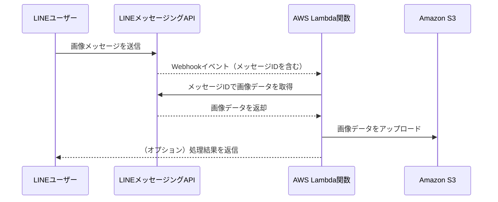

# line_media_saver

LINEのbotを利用して、画像や動画データを保存できる仕組み

# シーケンス図

```mermaid
sequenceDiagram
    participant ユーザー as LINEユーザー
    participant LINE as LINEメッセージングAPI
    participant Lambda as AWS Lambda関数
    participant S3 as Amazon S3

    ユーザー ->> LINE: 画像メッセージを送信
    LINE -->> Lambda: Webhookイベント（メッセージIDを含む）
    Lambda ->> LINE: メッセージIDで画像データを取得
    LINE -->> Lambda: 画像データを返却
    Lambda ->> S3: 画像データをアップロード
    Lambda -->> ユーザー: （オプション）処理結果を返信
```
